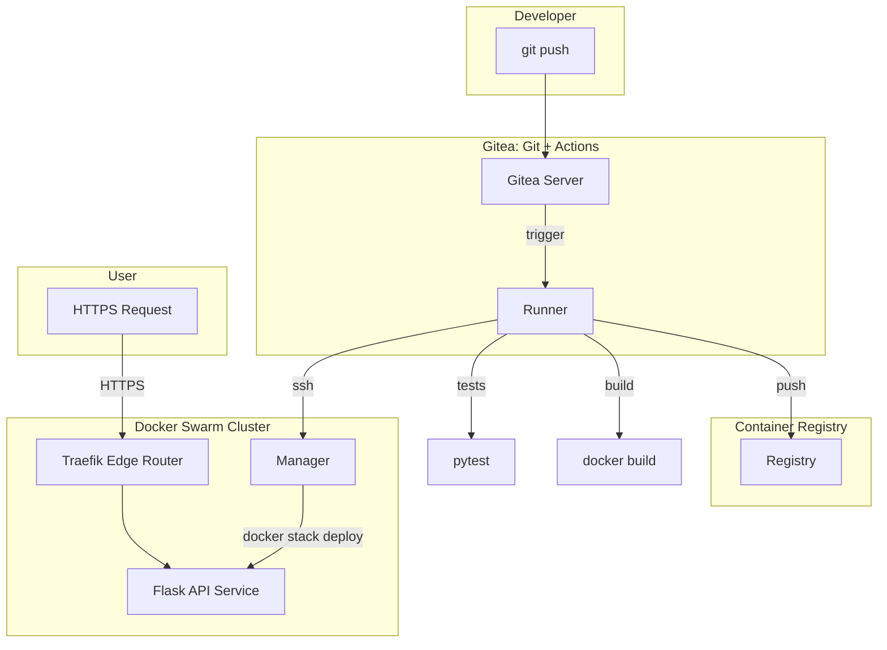

# 🐙 DevOps API Flask: Esteira de CI/CD 100% Auto-hospedada

> Template prático de **entrega contínua** com **Flask** + **Docker/Swarm** + **Traefik** + **Gitea Actions**, seguindo **Infraestrutura como Código (IaC)** e realizando *rolling updates* sem downtime.

A aplicação de exemplo é uma API em **Flask** (com *health check* em `GET /health`), mas o foco é a **arquitetura DevOps**: do `git push` ao deploy em produção, usando ferramentas **sob seu controle** em um cluster **Docker Swarm** com **Traefik** na borda.

---

## 📚 Sumário

* [Arquitetura](#arquitetura)
* [Pilha Tecnológica](#pilha-tecnologica)
* [Pré-requisitos](#pre-requisitos)
* [Guia Rápido (Local)](#guia-rapido-local)
* [Execução com Docker Compose](#execucao-com-docker-compose)
* [Orquestração: Docker Swarm + Traefik](#orquestracao-docker-swarm-traefik)
* [CI/CD com Gitea Actions](#cicd-com-gitea-actions)
* [Estrutura do Repositório](#estrutura-do-repositorio)
* [Testes e Cobertura](#testes-e-cobertura)
* [Configuração (.env)](#configuracao-env)
* [Boas Práticas de Segurança](#boas-praticas-de-seguranca)
* [Troubleshooting](#troubleshooting)
* [Licença](#licenca)

---

<a id="arquitetura"></a>

## 🏛 Arquitetura

A plataforma é composta por serviços containerizados. O **Traefik** executa a terminação TLS/HTTPS, o roteamento dinâmico por *labels* e o *service discovery* do Swarm. *Workflows* do **Gitea Actions** testam, criam e publicam a imagem da API e executam o deploy com *rolling update* no nó *manager* do Swarm.



---

<a id="pilha-tecnologica"></a>

## 🛠️ Pilha Tecnológica

| Componente             | Tecnologia               | O que faz                                                         |
| ---------------------- | ------------------------ | ----------------------------------------------------------------- |
| **Controle de versão** | **Gitea**                | Repositório Git auto-hospedado; aciona *workflows*.               |
| **CI/CD**              | **Gitea Actions**        | *Runners* executam testes, *build*, *push* e *deploy*.            |
| **Edge / Proxy**       | **Traefik**              | Roteamento dinâmico via *labels*, TLS/HTTPS, *service discovery*. |
| **Backend**            | **Python 3.11+ / Flask** | API REST com *health check* em `/health`.                         |
| **Containerização**    | **Docker**               | Imagens reprodutíveis (multi-stage).                              |
| **Orquestração**       | **Docker Swarm**         | *Stacks*, *services*, *rolling updates* e *rollback*.             |
| **Testes**             | **pytest / pytest-cov**  | Testes de unidade e relatório de cobertura.                       |

---

<a id="pre-requisitos"></a>

## ✅ Pré-requisitos

| Ferramenta     | Versão mínima | Verificar                |
| -------------- | ------------- | ------------------------ |
| Git            | 2.20+         | `git --version`          |
| Python         | 3.11+         | `python3 --version`      |
| Docker Engine  | 24.x+         | `docker --version`       |
| Docker Compose | v2+           | `docker compose version` |

> **Dica:** Garanta que o usuário no host *manager* pode executar Docker sem `sudo` (ou ajuste os comandos).

---

<a id="guia-rapido-local"></a>

## 🚀 Guia Rápido (Local)

### 1) Clonar o repositório

```bash
git clone https://github.com/theunrealryan/devops-api-flask.git
cd devops-api-flask
```

### 2) Rodar localmente (sem Docker, opcional)

```bash
python3 -m venv .venv
source .venv/bin/activate   # Windows: .venv\Scripts\activate
pip install -r requirements.txt
python app.py
```

### 3) Verificar *health*

```bash
curl http://localhost:5000/health
# Esperado: {"status":"healthy"}
```

---

<a id="execucao-com-docker-compose"></a>

## 🐳 Execução com Docker Compose

> Útil para desenvolvimento local com containers e validação da imagem.

```bash
docker compose up --build -d
docker ps
curl http://localhost:5000/health
```

Para parar/remover:

```bash
docker compose down -v
```

---

<a id="orquestracao-docker-swarm-traefik"></a>

## 🧩 Orquestração: Docker Swarm + Traefik

### 1) Criar a *overlay network* compartilhada (uma vez)

```bash
docker network create --driver=overlay --attachable web
```

### 2) Inicializar o Swarm (nó manager)

```bash
docker swarm init --advertise-addr <IP_MANAGER>
```

### 3) Deploy da stack

```bash
docker stack deploy -c docker-compose.yml devops
```

### 4) Escalar a API (exemplo)

```bash
docker service scale devops_api=3
```

### 5) Atualizar imagem (rolling update) e rollback

```bash
docker service update --image <registry>/devops-api-flask:<tag> devops_api
docker service update --rollback devops_api
```

### Exemplo de *labels* Traefik (ajuste domínio/porta)

```yaml
services:
  api:
    image: <registry>/devops-api-flask:latest
    networks:
      - web     # mesma overlay network do Traefik
    deploy:
      labels:
        - traefik.enable=true
        - traefik.http.routers.api.rule=Host(`api.seu-dominio.com`)
        - traefik.http.routers.api.entrypoints=websecure
        - traefik.http.routers.api.tls=true
        - traefik.http.services.api.loadbalancer.server.port=5000

networks:
  web:
    external: true
```

> Em Swarm, *labels* ficam sob `deploy.labels`. Garanta **mesma overlay** entre Traefik e API.

---

<a id="cicd-com-gitea-actions"></a>

## 🚦 CI/CD com Gitea Actions

O pipeline (ex.: `.gitea/workflows/deploy.yml`) executa:

1. **Testes** com `pytest`;
2. **Build** da imagem Docker (multi-stage);
3. **Push** ao *registry*;
4. **Deploy** no *manager* do Swarm via SSH, com `docker stack deploy -c docker-compose.yml <stack>`.

### Exemplo de workflow (`.gitea/workflows/deploy.yml`)

```yaml
name: Deploy
on:
  push:
    branches: [ main ]

jobs:
  build-test-push-deploy:
    runs-on: docker
    steps:
      - uses: actions/checkout@v4

      - name: Testes
        run: |
          python -V
          pip install -r requirements.txt pytest pytest-cov
          pytest --maxfail=1 --disable-warnings -q

      - name: Build & Push
        env:
          REGISTRY_URL: ${{ secrets.REGISTRY_URL }}
          REGISTRY_USERNAME: ${{ secrets.REGISTRY_USERNAME }}
          REGISTRY_PASSWORD: ${{ secrets.REGISTRY_PASSWORD }}
          IMAGE_REPO: devops-api-flask
        run: |
          docker login "$REGISTRY_URL" -u "$REGISTRY_USERNAME" -p "$REGISTRY_PASSWORD"
          IMAGE_TAG=${GITHUB_SHA::7}
          docker build -t "$REGISTRY_URL/$IMAGE_REPO:$IMAGE_TAG" .
          docker push "$REGISTRY_URL/$IMAGE_REPO:$IMAGE_TAG"

      - name: Deploy no Swarm (SSH)
        env:
          SSH_HOST: ${{ secrets.SSH_HOST }}
          SSH_USER: ${{ secrets.SSH_USER }}
          SSH_PRIVATE_KEY: ${{ secrets.SSH_PRIVATE_KEY }}
          STACK_NAME: ${{ secrets.STACK_NAME }}
          COMPOSE_FILE: ${{ secrets.COMPOSE_FILE }}
        run: |
          mkdir -p ~/.ssh
          echo "$SSH_PRIVATE_KEY" > ~/.ssh/id_rsa
          chmod 600 ~/.ssh/id_rsa
          ssh -o StrictHostKeyChecking=no "$SSH_USER@$SSH_HOST" \
            "IMAGE_TAG=${GITHUB_SHA::7} STACK_NAME=$STACK_NAME docker stack deploy -c $COMPOSE_FILE $STACK_NAME"
```

**Secrets sugeridos**:

* `REGISTRY_URL`, `REGISTRY_USERNAME`, `REGISTRY_PASSWORD`
* `SSH_HOST`, `SSH_USER`, `SSH_PRIVATE_KEY`
* `STACK_NAME` (ex.: `devops`) e `COMPOSE_FILE` (ex.: `docker-compose.yml`)

> **Dica:** versionar imagens com a *tag* baseada no SHA curto do commit (`${GITHUB_SHA::7}`) facilita *rollbacks* reprodutíveis.

---

<a id="estrutura-do-repositorio"></a>

## 📁 Estrutura do Repositório

```
.
├─ .gitea/workflows/      # Workflows de CI/CD (Gitea Actions)
├─ tests/                 # Testes (pytest)
├─ app.py                 # Aplicação Flask (expõe /health)
├─ Dockerfile             # Build multi-stage
├─ docker-compose.yml     # Stack para Compose/Swarm (com deploy/labels)
├─ pyproject.toml         # Metadados e config de build
├─ pytest.ini             # Configuração de testes
├─ requirements.txt       # Dependências Python
├─ .gitignore
└─ LICENSE                # MIT
```

---

<a id="testes-e-cobertura"></a>

## 🧪 Testes e Cobertura

```bash
python3 -m venv .venv
source .venv/bin/activate
pip install -r requirements.txt pytest pytest-cov
pytest --cov=app
```

**Recomendações:**

* Cubra *rotas* críticas (incluindo `/health`) e fluxos de erro.
* Publique o *coverage* no pipeline e **falhe** *builds* abaixo de um limiar mínimo (ex.: 80%).

---

<a id="configuracao-env"></a>

## ⚙️ Configuração (.env)

Crie seu `.env` a partir do exemplo:

```bash
cp .env.example .env
```

Variáveis comuns:

| Variável       | Exemplo               | Uso                                                               |
| -------------- | --------------------- | ----------------------------------------------------------------- |
| `FLASK_ENV`    | `production`          | Modo de execução do Flask.                                        |
| `FLASK_HOST`   | `0.0.0.0`             | Host de *bind* do servidor.                                       |
| `FLASK_PORT`   | `5000`                | Porta do app (use a mesma no Traefik `loadbalancer.server.port`). |
| `REGISTRY_URL` | `registry.local:5000` | Registry para *push* da imagem.                                   |
| `STACK_NAME`   | `devops`              | Nome lógico da *stack* no Swarm.                                  |

> **Importante:** não *commitar* `.env`. Use **Secrets** no Gitea para credenciais/chaves.

---

<a id="boas-praticas-de-seguranca"></a>

## 🔐 Boas Práticas de Segurança

* **Segredos no Gitea**: tokens do registry, chaves SSH, etc.
* **Menor privilégio** no host *manager* (evite `root` e chaves amplas).
* **TLS por padrão** via Traefik (certificados válidos e *entrypoints* seguros).
* **Rollback** pronto para qualquer atualização (Swarm suporta rollback manual).
* **Pin de versão** no `Dockerfile` (evita *breakages* silenciosos).
* **Dependências auditadas**: fixe/atualize `requirements.txt` periodicamente.

---

<a id="troubleshooting"></a>

## 🛟 Troubleshooting

* **Traefik não roteia** → verifique *deploy.labels* e a **overlay network** compartilhada.
* **Rolling update travado** → `docker service ps <service>` e `docker service logs <service>`; se preciso, `docker service update --rollback`.
* **/health falha** → *health check* leve (sem dependências externas) para evitar reinícios em cascata.
* **Falha no registry** → cheque DNS/porta, `docker login` e permissões de *push*.
* **Overlay ausente** → `docker network create --driver=overlay --attachable web` e conecte Traefik + serviços.

---

<a id="licenca"></a>

## 📄 Licença

Este projeto é licenciado sob **MIT**. Veja `LICENSE`.

> *“Automate all the things, but understand each step.”*
